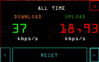

# NetSpeedMonitor
Internet speed monitoring program developed with C# for Windows.

The start position in the program is in the lower right corner. The mouse can be moved to the desired location.

## Screenshots

&nbsp;&nbsp;
&nbsp;&nbsp;

